# PayPort

**Compliant B2B stablecoin payment infrastructure on HashKey Chain via HP2.**

PayPort turns stablecoin checkout into an operator-ready merchant flow: onboarding with compliance context, signed payment creation, verified webhook settlement, and real-time payment state tracking.

---

## What Problem Are We Solving?

Most crypto payment demos end at "payment link created".

Real merchants need more than that:

- compliance-aware onboarding before accepting funds
- clear payment lifecycle states after checkout
- auditable settlement evidence for finance and ops teams
- live visibility into pending, confirmed, settled, and failed orders

PayPort solves this end to end.

---

## Product Overview

- Merchant registration and app-key based auth (`x-app-key`)
- KYC-gated onboarding path (runtime toggle via env)
- HP2 Single-Pay order creation
- Cart Mandate authorization using ES256K JWT
- HP2 request signing and webhook verification (HMAC-SHA256)
- Order state machine: `initiated`, `pending`, `confirmed`, `settled`, `failed`
- Real-time merchant updates through SSE
- Drop-in script SDK at `/sdk/payport.js`

---

## Dashboard Walkthrough

### Dashboard Overview

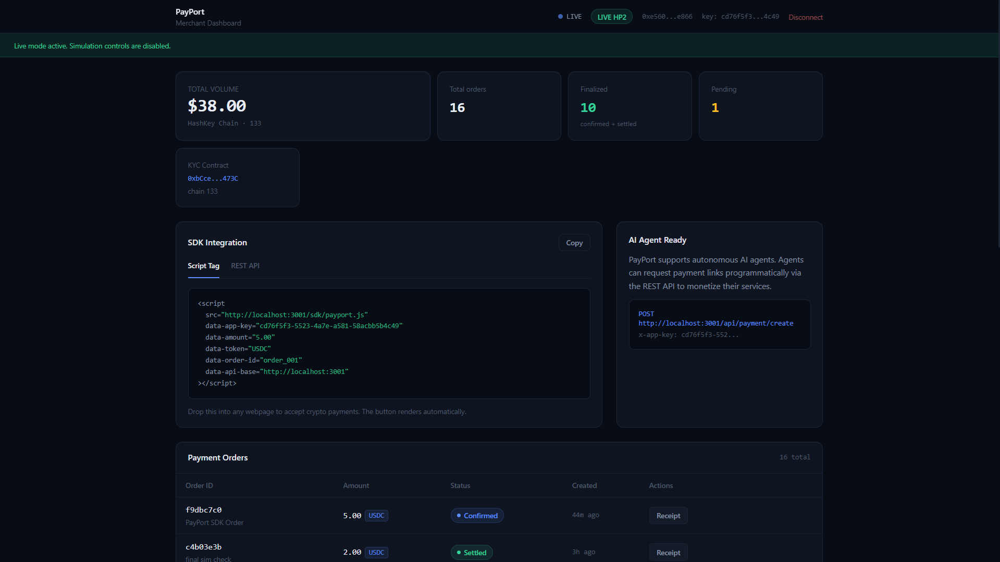

The dashboard is the merchant operations console. It shows live mode status, stream health, order totals, payment lifecycle state, activity feed, and settlement receipts.

### Onboarding and Merchant Registration

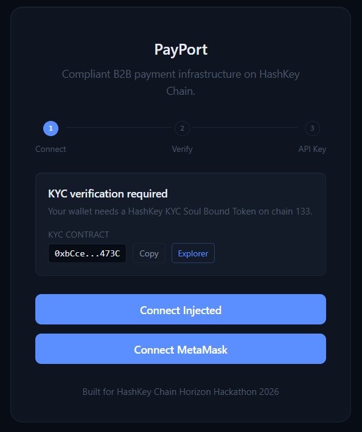
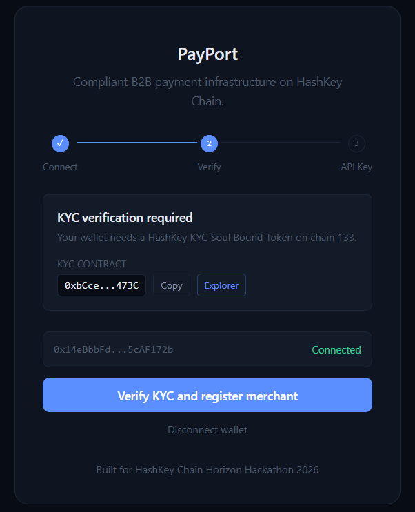

This flow establishes merchant context, wallet identity, and app-key provisioning.

### SDK Integration Paths

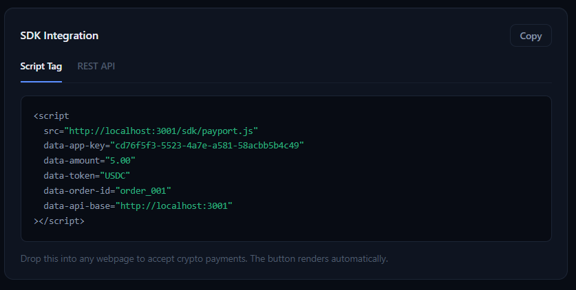
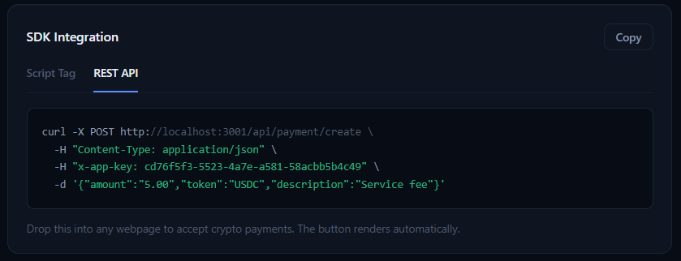

Merchants can integrate through a one-script embed or direct REST APIs.

### Checkout and Settlement Proof

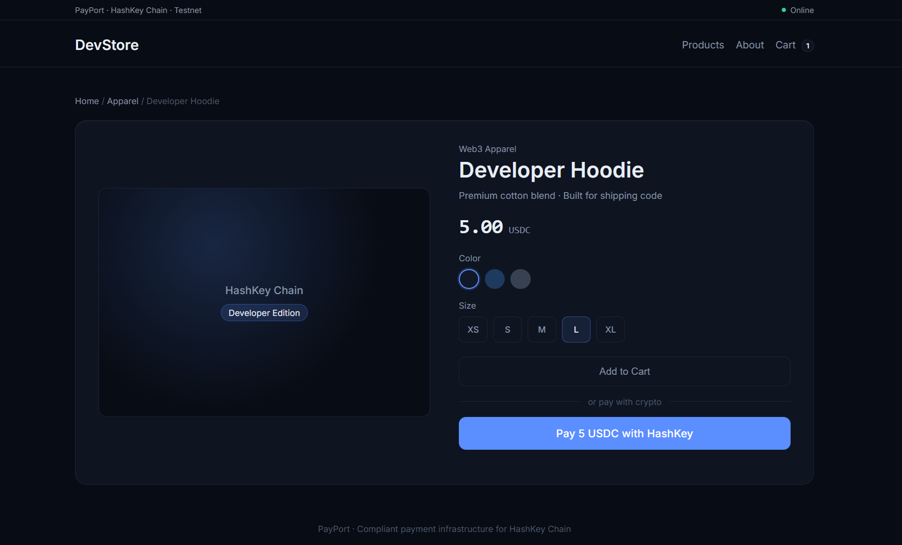
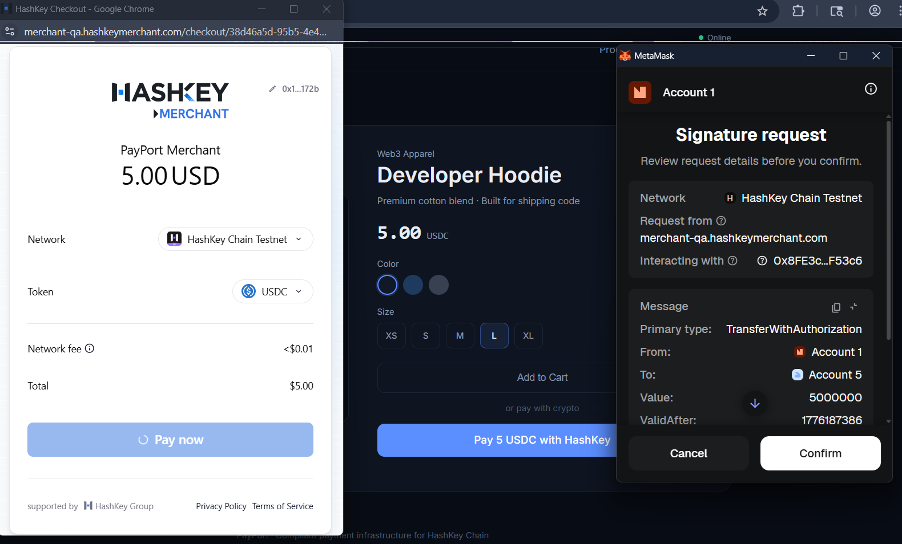
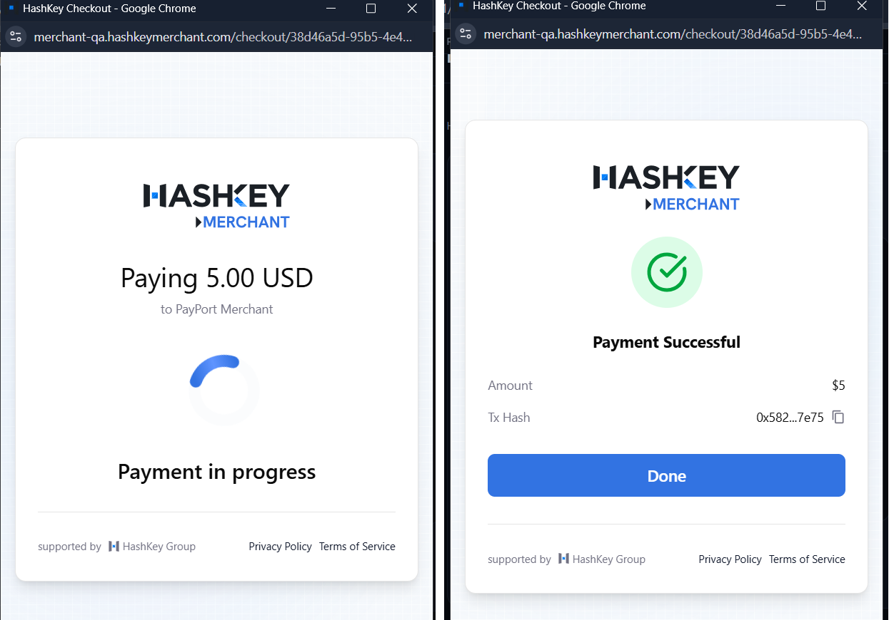
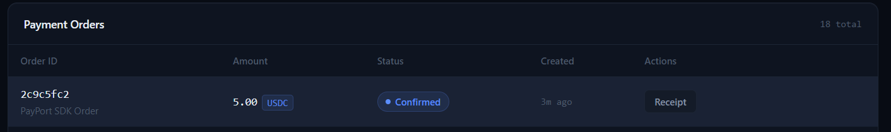
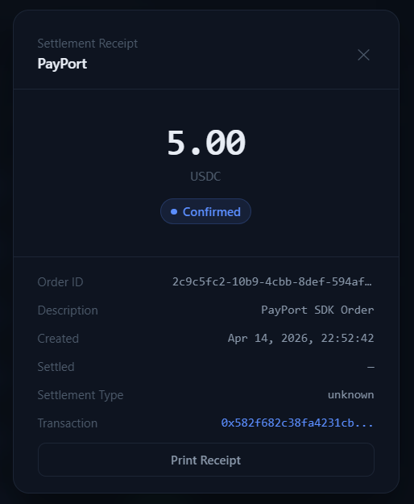
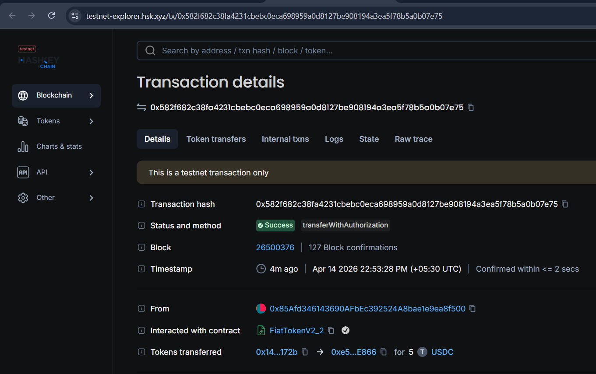

This sequence proves storefront checkout handoff, provider progression, dashboard reconciliation, receipt generation, and explorer-level settlement evidence.

---

## Architecture

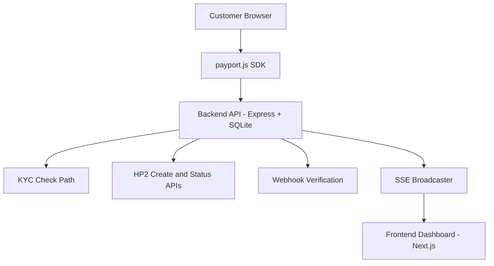

---

## Hackathon Fit

- Hackathon: HashKey Chain Horizon Hackathon
- Track: PayFi
- Chain: HashKey Chain Testnet (`chainId=133`)
- Payment rail: HP2
- Compliance anchor: KYC SBT check path in onboarding
- Verifiable output: explorer-linked settlement proof and event-backed status logs

---

## Quick Start

### Prerequisites

- Node.js 20+
- npm 10+
- PowerShell
- ngrok (required for live HP2 webhook callback)
- Foundry (optional, only for contracts)

### 1. Install dependencies

```powershell
cd backend
npm install

cd ..\frontend
npm install
```

### 2. Configure environment files

```powershell
cd ..\backend
Copy-Item .env.example .env

cd ..\frontend
Copy-Item .env.example .env.local
```

Required in `backend/.env`:

- `MERCHANT_PRIVATE_KEY` as 32-byte hex (`0x...`)
- `HP2_MOCK=false`
- `HP2_APP_KEY` set
- `HP2_APP_SECRET` set

Live mode values:

```text
HP2_BASE_URL=https://merchant-qa.hashkeymerchant.com
ENABLE_SIMULATE_ENDPOINT=false
HP2_WEBHOOK_URL=https://<your-ngrok-domain>/api/webhook
```

Simulation mode values:

```text
HP2_BASE_URL=http://localhost:3002
ENABLE_SIMULATE_ENDPOINT=true
```

### 3. Start the app

Live mode:

```powershell
cd backend
powershell -File sim\start-live.ps1
```

Simulation mode:

```powershell
cd backend
powershell -File sim\start-sim.ps1
```

Stop all:

```powershell
cd backend
powershell -File sim\stop-all.ps1
```

### 4. Open URLs

- Demo Store: `http://localhost:3001/demo`
- Dashboard: `http://localhost:3000/dashboard`
- Onboarding: `http://localhost:3000/onboard`
- Health: `http://localhost:3001/api/health`

### 5. Verify runtime mode

```powershell
Invoke-RestMethod http://localhost:3001/api/health | ConvertTo-Json -Depth 5
```

Live mode expected:

- `liveMode: "true"`
- `simulateEnabled: "false"`
- `mockMode: "false"`

---

## API Surface

| Method | Endpoint                                  | Auth               | Purpose                    |
| ------ | ----------------------------------------- | ------------------ | -------------------------- |
| POST   | `/api/merchant/register`                  | none               | Register merchant wallet   |
| GET    | `/api/merchant/me`                        | `x-app-key`        | Fetch merchant profile     |
| POST   | `/api/payment/create`                     | `x-app-key`        | Create payment order       |
| GET    | `/api/payment/status/:paymentRequestId`   | `x-app-key`        | Reconciled payment status  |
| GET    | `/api/payment/orders`                     | `x-app-key`        | Orders and recent events   |
| POST   | `/api/webhook`                            | provider signature | HP2 webhook callback       |
| POST   | `/api/webhook/simulate/:paymentRequestId` | `x-app-key`        | Simulation settle endpoint |
| GET    | `/api/stream?key=<appKey>`                | query key          | SSE stream                 |
| GET    | `/api/health`                             | none               | Runtime mode and health    |

---

## Repository Structure

```text
hsp2/
	backend/
		constants.js
		db.js
		server.js
		routes/
		lib/
		sim/
		public/
	frontend/
		app/
		components/
		hooks/
		lib/
	contracts/
		src/
		script/
		test/
	images/
```

---

## Contracts

From `contracts/`:

```powershell
forge build
forge test -vvv
```

Network config uses HashKey testnet RPC: `https://testnet.hsk.xyz`.

---

## Security Notes

- Webhook signatures are verified in non-mock HP2 mode
- Merchant APIs are scoped by app key
- Rate limiting is enabled on registration and payment creation
- Simulation endpoint should remain disabled in live demos

---

## Team

- [Arshdeep Singh](https://github.com/arshlabs)
- [Parth Singh](https://github.com/parthsinghps)

Built for HashKey Chain Horizon Hackathon.
