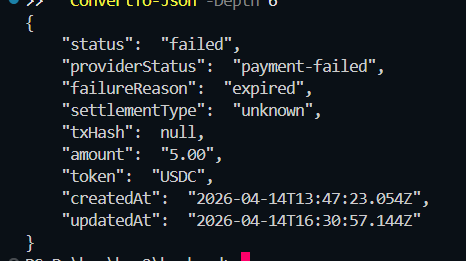

# PayPort

Accept USDC and USDT payments on HashKey Chain with one script tag.

PayPort is a drop-in payment SDK for HashKey Chain. Add it to any website with a single `<script>` tag and start accepting stablecoin payments in minutes, no custom HP2 integration required. Built for the [HashKey Chain Horizon Hackathon](https://dorahacks.io/hackathon/2045) 2026, PayFi track.

---

## For Merchants: Three Steps

1. **Get verified** - Connect your wallet on HashKey Chain Testnet. PayPort checks your KYC Soul Bound Token on-chain before issuing an API key. Compliance happens at entry, not as paperwork later.

2. **Embed one script** - Add `payport.js` to your page with your API key. A styled **Pay with HashKey** button appears. When clicked, it creates a payment order, opens the HashKey checkout, and handles the entire payment lifecycle.

3. **Watch it settle** - The merchant dashboard shows every order state in real time via SSE. When a payment confirms on HashKey Chain, the webhook fires, your order settles, and a receipt with an on-chain transaction reference appears.

```html
<!-- Add to any webpage - that's the entire integration -->
<div data-payport="true"></div>
<script
  src="http://localhost:3001/sdk/payport.js"
  data-app-key="your_app_key"
  data-amount="25.00"
  data-token="USDC"
  data-description="Product name"
  async
></script>
```

---

## Dashboard


The dashboard is the merchant control surface. It shows live mode status, stream health, order totals, payment lifecycle state, activity feed, and settlement receipts. Everything updates in real time through SSE via [`usePaymentStream`](frontend/hooks/usePaymentStream.ts), which listens to `/api/stream?key=` and pushes `order.created`, `order.updated`, and `event.log` events into the UI without polling.

### Onboarding and Merchant Registration


The onboarding flow establishes wallet identity, runs the KYC SBT check via [`kyc.js`](backend/lib/kyc.js), and provisions an `x-app-key`. In production mode, `isHuman()` is called on the [deployed MockKycSBT contract](https://testnet-explorer.hsk.xyz/address/0xbCcec0676BE0C5C40927389F193DF38Dc1be473C) to verify the wallet holds an APPROVED credential at BASIC level or above. If the check fails, registration is rejected. `DEV_BYPASS_KYC=true` skips this for demo speed.

### SDK Integration Paths


Two integration paths. The **Script Tag** is for websites: drop it into any page and a checkout button renders automatically. The **REST API** is for backends and AI agents that need to create payment links programmatically. Both are shown in the dashboard with copyable snippets.

```sh
# REST API path — create a payment link from any backend or agent
curl -X POST http://localhost:3001/api/payment/create \
  -H "Content-Type: application/json" \
  -H "x-app-key: your_app_key" \
  -d '{"amount":"5.00","token":"USDC","description":"Service fee"}'
```

### Checkout and Settlement Proof


This sequence shows the full path: storefront checkout button (rendered by `payport.js`), HP2 checkout popup at `merchant-qa.hashkeymerchant.com`, dashboard reconciliation via webhook + SSE, receipt modal with settlement metadata, and explorer-level on-chain proof. The tx hash in the receipt matches the explorer transaction.

### Failure Diagnostics



PayPort surfaces provider-level diagnostics through `/api/payment/status/:paymentRequestId`, including `providerStatus` and `failureReason`. The [`reconcileOrderFromHp2`](backend/routes/payment.js) function cross-checks internal state against the HP2 provider on every status request, so the dashboard always reflects the real state, not a stale cache.

---

## What's Built

This is a full-stack hackathon project with all layers integrated end to end. The SDK talks to the backend, the backend talks to HP2, webhooks settle orders, and the dashboard streams everything live.

| Layer              | What                                                                         | Why It Matters                                   |
| ------------------ | ---------------------------------------------------------------------------- | ------------------------------------------------ |
| payport.js SDK     | Drop-in JS widget, popup checkout, postMessage callback                      | Merchants integrate without touching the HP2 API |
| Backend API        | Node.js + Express + SQLite, HP2 Cart Mandate signing, webhook verification   | All HP2 complexity is abstracted                 |
| Merchant Dashboard | Next.js 14, Wagmi v2, SSE live updates                                       | Real-time ops visibility                         |
| KYC Contract       | MockKycSBT on HashKey Testnet (`0xbCcec0676BE0C5C40927389F193DF38Dc1be473C`) | On-chain compliance gate                         |
| HP2 Integration    | Cart Mandate JWT (ES256K), HMAC-SHA256, real webhook settlement              | Live against merchant-qa.hashkeymerchant.com     |

---

## HP2 Integration

PayPort is registered on the HashKey Merchant QA platform as ArthFi (Merchant ID: 01468340) on hashkey-testnet. Payment orders are created via `POST /api/v1/merchant/orders` with a Cart Mandate JWT signed using ES256K secp256k1 (see [`mandate.js`](backend/lib/mandate.js)). The signing flow builds a canonical JSON cart, SHA-256 hashes it, constructs JWT claims with the cart hash, and signs with `@noble/curves/secp256k1`. Incoming webhooks are verified with HMAC-SHA256 using `timingSafeEqual` in [`webhook.js`](backend/routes/webhook.js) before any order state changes. All 7 HP2 payment states are handled: `payment-required`, `payment-submitted`, `payment-verified`, `payment-processing`, `payment-safe`, `payment-included`, `payment-successful`, plus `payment-failed`.

| Detail      | Value                                                                                                |
| ----------- | ---------------------------------------------------------------------------------------------------- |
| Merchant    | ArthFi (ID: 01468340)                                                                                |
| Environment | merchant-qa.hashkeymerchant.com                                                                      |
| Tokens      | USDC `0x8FE3cB719Ee4410E236Cd6b72ab1fCDC06eF53c6`, USDT `0x372325443233fEbaC1F6998aC750276468c83CC6` |
| Chain       | HashKey Chain Testnet (chainId: 133)                                                                 |
| Auth        | ES256K Cart Mandate JWT + HMAC-SHA256                                                                |

---

## Quick Start

### Requirements

```text
Node.js 20+
npm 10+
ngrok (for HP2 webhook callbacks in live mode)
Foundry (optional, contracts only)
```

### Setup

**Step 1 - Install:**

```sh
cd backend && npm install
cd ../frontend && npm install
```

**Step 2 - Configure:**

Copy `.env.example` to `.env` in both `backend/` and `frontend/`.

Required backend env vars:

```text
MERCHANT_PRIVATE_KEY=0x<your-32-byte-key>
HP2_BASE_URL=https://merchant-qa.hashkeymerchant.com
HP2_APP_KEY=<from HashKey console>
HP2_APP_SECRET=<from HashKey console>
HP2_WEBHOOK_URL=https://<your-ngrok-domain>/api/webhook
HP2_MOCK=false
ENABLE_SIMULATE_ENDPOINT=false
```

**Step 3 - Start (Windows):**

```powershell
# Live mode - real HP2, no simulator
cd backend
powershell -File sim\start-live.ps1

# Sim mode - local HP2 simulator for dev
cd backend
powershell -File sim\start-sim.ps1
```

**Step 4 - Open:**

```text
Demo store:   http://localhost:3001/demo
Dashboard:    http://localhost:3000/dashboard
Onboarding:   http://localhost:3000/onboard
Health:       http://localhost:3001/api/health
```

### MetaMask (for real payments)

| Setting      | Value                            |
| ------------ | -------------------------------- |
| Network Name | HashKey Chain Testnet            |
| RPC URL      | https://testnet.hsk.xyz          |
| Chain ID     | 133                              |
| Symbol       | HSK                              |
| Explorer     | https://testnet-explorer.hsk.xyz |

Get testnet HSK from [faucet.hsk.xyz](https://faucet.hsk.xyz). For testnet USDC, contact hsp_hackathon@hashkey.com.

---

## API Reference

| Method | Path                      | Auth          | Purpose                           |
| ------ | ------------------------- | ------------- | --------------------------------- |
| POST   | `/api/merchant/register`  | none          | Register wallet, get app key      |
| GET    | `/api/merchant/me`        | x-app-key     | Merchant profile                  |
| POST   | `/api/payment/create`     | x-app-key     | Create HP2 payment order          |
| GET    | `/api/payment/status/:id` | x-app-key     | Payment status and provider state |
| GET    | `/api/payment/orders`     | x-app-key     | Order list and event log          |
| POST   | `/api/webhook`            | HP2 signature | HP2 settlement callback           |
| GET    | `/api/stream?key=`        | query key     | SSE live updates                  |

---

## Repository Structure

```text
payport/
  backend/
    lib/          hp2.js, mandate.js, kyc.js
    routes/       merchant, payment, webhook, stream
    sim/          hp2-sim.js, start-live.ps1, start-sim.ps1
    public/
      sdk/        payport.js
      demo/       index.html
  frontend/
    app/          onboard, dashboard, mock-payment
    components/   StatsBar, OrdersTable, PaymentLog, ReceiptModal
    hooks/        usePaymentStream
  contracts/
    src/          MockKycSBT.sol
    test/         MockKycSBT.t.sol
```

---

## Smart Contracts

MockKycSBT is a Soul Bound Token contract that gates merchant registration. Only wallets holding this non-transferable credential (status `APPROVED`, level `BASIC`+) can receive a PayPort API key. The contract exposes `isHuman(address)` for the boolean gate and `getKycInfo(address)` for full credential details. Users can self-register with `requestKyc()` by paying 0.001 HSK.

|          |                                                                                                                 |
| -------- | --------------------------------------------------------------------------------------------------------------- |
| Contract | MockKycSBT                                                                                                      |
| Network  | HashKey Chain Testnet                                                                                           |
| Address  | `0xbCcec0676BE0C5C40927389F193DF38Dc1be473C`                                                                    |
| Explorer | [View on testnet explorer](https://testnet-explorer.hsk.xyz/address/0xbCcec0676BE0C5C40927389F193DF38Dc1be473C) |

```sh
# Run tests
cd contracts
forge test -vvv
```

---

## Security

- **Webhook verification** - Every HP2 callback is verified with HMAC-SHA256 before any order state changes. Forged webhooks are rejected with 200 (to suppress HP2 retries) but not processed.

- **CORS restriction** - The backend allows requests only from localhost:3000, localhost:3001, and the configured ngrok domain. The webhook route is the only exception (accepts HP2 server IPs).

- **Rate limiting** - Merchant registration: 10 requests/IP/hour. Payment creation: 60 requests/IP/minute. Both enforced in-process.

- **Simulation gating** - The settlement simulation endpoint returns 403 by default. Enable only via `ENABLE_SIMULATE_ENDPOINT=true` in development environments.

---

## Team

Built by [Arshdeep Singh](https://github.com/arshlabs) and [Parth Singh](https://github.com/parthsinghps) for [HashKey Chain Horizon Hackathon 2026](https://dorahacks.io/hackathon/2045).
